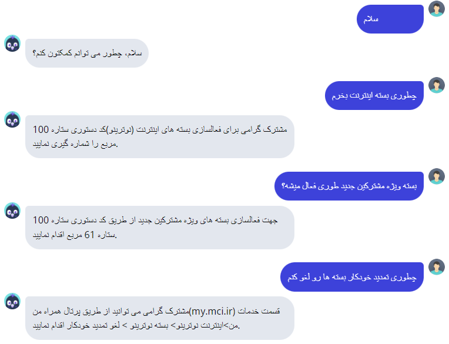
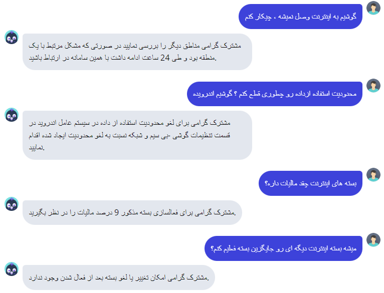

# FAQ-Chatbot

This is a example Rasa frequently asked question and answer Chatbot that developed for Hamrah e Aval IT Helpdesk.

Here is an example of a conversation you can have with this bot:





**Table of Contents**

- [FAQ Chatbot](#FAQ-Chatbot)
  - [Setup](#setup)
    - [Install the dependencies](#install-the-dependencies)
  - [Running the bot](#running-the-bot)
  - [Handoff](#handoff)
    - [Try it out](#try-it-out)
  - [Testing the bot](#testing-the-bot)

<!-- END doctoc generated TOC please keep comment here to allow auto update -->

## Setup

### Install the dependencies

In a Python3 virtual environment run:

```bash
pip install -r requirements.txt
```

## Running the bot

Use `rasa train` to train a model.
```

Then to talk to the bot, run:

```bash
rasa shell
```
## Things you can ask the bot

The bot has one main skill to answers to questions about:
1. Activate and purchase Internet data packages
2. Cancel automatic continuation of a data package
3. costs of Internet connection
4. Internet connection problems

Take a look at `data/nlu.md` to see what the bot is currently trained to recognize.

It can also respond to requests for help (e.g. "help me").

If configured, the bot can also hand off to another bot in response to the user asking for handoff. More [details on handoff](#handoff) below.


## Handoff

This bot includes a simple skill for handing off the conversation to another bot or a human.


### Try it out

The simplest way to use the handoff feature is to do the following:

1. copy [WebChat](WebChat) folder to the project location
5. run the rasa server and action server at the default ports (shown here for clarity)
   In one terminal window:
    ```bash
    rasa run -m models --enable-api --cors "*" –debug
    ```
7. Open [chatroom_handoff.html](WebChat/index.html) in a browser to see handoff in action


## Testing the bot

You can test the bot on the test conversations by running  `rasa test`.
This will run [end-to-end testing](https://rasa.com/docs/rasa/user-guide/testing-your-assistant/#end-to-end-testing) on the conversations in `tests/conversation_tests.md`.
